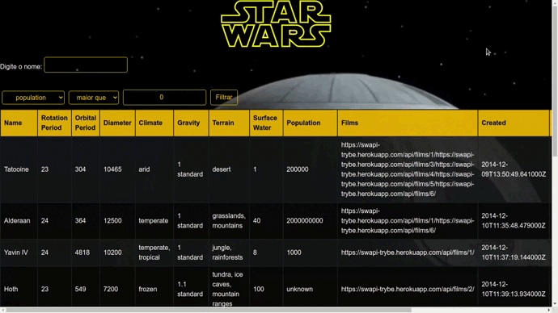

# O que é a aplicação
Desenvolvido enquanto estudante da trybe no módulo de Front-End, o projeto é uma lista com filtros de planetas do universo de Star Wars usando **Context API e Hooks** para controlar os estados globais. 

Nesse projeto, foram utilizados:
* Context API_ do **React** para gerenciar estado.
* React Hook useState_;
* React Hook useContext_;
* React Hook useEffect_;
* React Hooks_ customizados.

# Aplicação

Demonstração do projeto:

    

A aplicação pode ser acessada clicando [aqui](https://star-wars-ten.vercel.app/)

# Como Instalar e Utilizar
Caso queira rodar a aplicação localmente:

 1- Abra o terminal, e clone o repositório 
 
 - `git clone git@github.com:Adadezer/star-wars.git`.

  2- Entre na pasta do repositório que você acabou de clonar:
 - `cd star-wars`

  3- Instale as dependências:
 - `npm install`
  
 4- Execute o projeto
 - `npm start`

##

  

